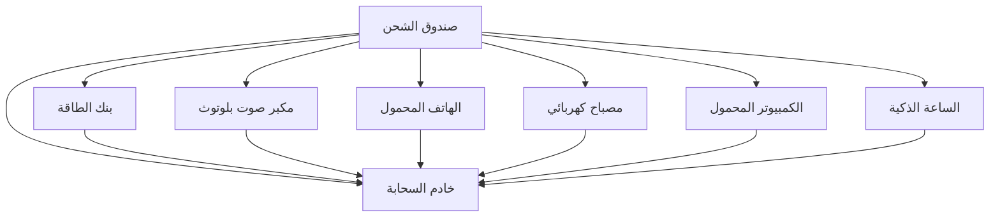

## المراجع

المرجع [^1].

في الحواشي السفلية، تذكر إضافة `:` بعد `[الرقم]` للتحليل الصحيح.

---

## تصنيف الصور

يمكنك تطبيق الفئات على الصور في Markdown بهذه الطريقة:

```markdown
{: .centered }
{: .responsive }
*المصدر: Telegram*{: .caption }
```

سيؤدي هذا إلى عرض الصورة مع الفئات المحددة:

{: .centered }  
{: .responsive }  
*المصدر: Telegram*{: .caption }

## جدول المحتويات

- [مقدمة](#introduction)
- [الفصل الأول](#chapter-1)
- [الخاتمة](#conclusion)

---

### مقدمة

إليك المقدمة.

---

### الفصل الأول

إليك الفصل الأول.

---

### الخلاصة

إليك الخلاصة.

## ميرميد



لا يزال غير معروض هنا، ولكنه يعمل بشكل جيد ويمكن إنشاؤه في Mistral. دعونا نجد بعض الوقت لتعلم المزيد.

---

[^1]: هنا واحد.
`