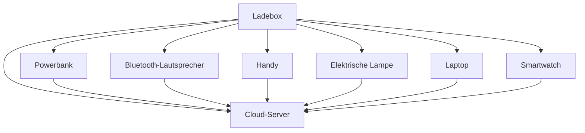

## Referenzen

Referenz [^1].

In Fußnoten denken Sie daran, nach der `[Nummer]` einen `:` hinzuzufügen, um eine korrekte Analyse zu gewährleisten.

---

## Bildklasse

Sie können Klassen auf Bilder in Markdown wie folgt anwenden:

```markdown
{: .zentriert }
{: .responsiv }
*Quelle: Telegram*{: .caption }
```

Dies rendert das Bild mit den angegebenen Klassen:

{: .centered }  
{: .responsive }  
*Quelle: Telegram*{: .caption }

## Inhaltsverzeichnis

- [Einführung](#introduction)
- [Kapitel 1](#chapter-1)
- [Fazit](#conclusion)

---

### Einführung

Hier ist die Einleitung.

---

### Kapitel 1

Hier ist Kapitel 1.

---

### Fazit

Hier ist die Schlussfolgerung.

## Mermaid



Es wird hier immer noch nicht gerendert, aber es funktioniert gut und kann in Mistral generiert werden. Lass uns etwas Zeit finden, um mehr zu lernen.

---

[^1]: Hier ist einer.
```