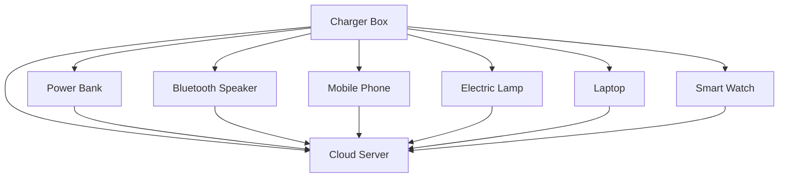

## References

Reference [^1].

In footnotes, remember to add a `:` after the `[number]` for correct parsing.

---

## Image Class

You can apply classes to images in Markdown like this:

```markdown
{: .centered }
{: .responsive }
*Source: Telegram*{: .caption }
```

This will render the image with the specified classes:

{: .centered }  
{: .responsive }  
*Source: Telegram*{: .caption }

## Table of Contents

- [Introduction](#introduction)
- [Chapter 1](#chapter-1)
- [Conclusion](#conclusion)

---

### Introduction

Here is the introduction.

---

### Chapter 1

Here is Chapter 1.

---

### Conclusion

Here is the conclusion.

## Mermaid



It's still not rendered here, but it works well and can be generated in Mistral. Let's find some time to learn more.

---

[^1]: Here is one.
`