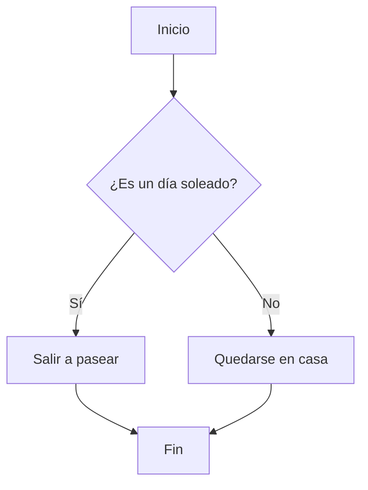
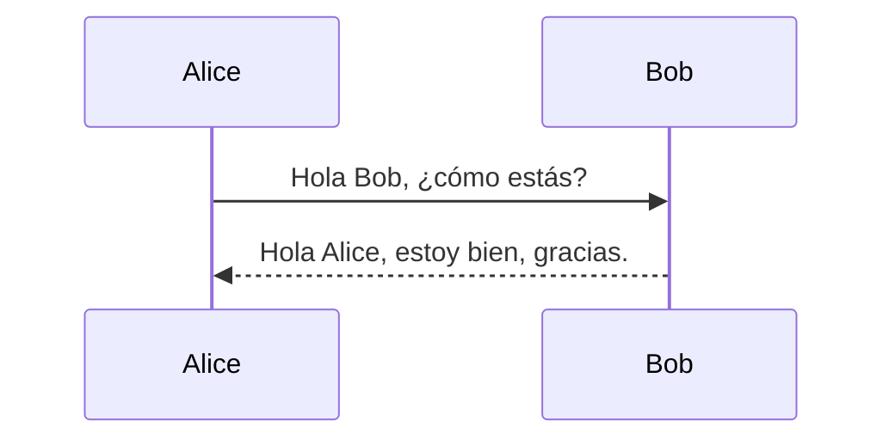
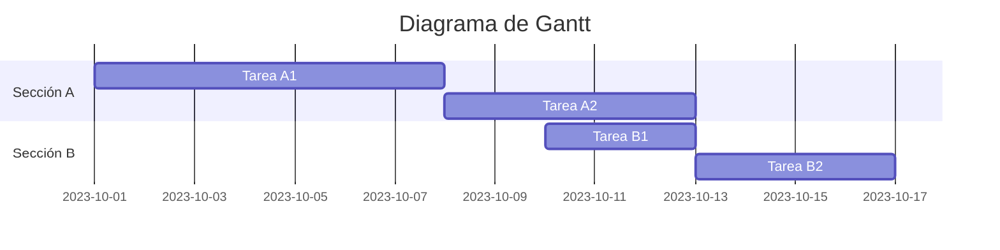
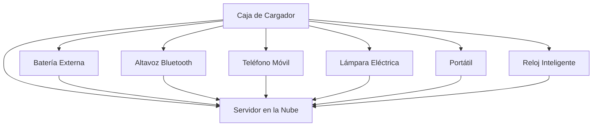

## Referencias

Referencia [^1].

En las notas al pie, recuerda agregar `:` después del `[número]` para un análisis correcto.

---

## Clase de Imagen

Puedes aplicar clases a imágenes en Markdown de la siguiente manera:

```markdown
{: .centered }
{: .responsive }
*Fuente: Telegram*{: .caption }
```

Esto renderizará la imagen con las clases especificadas:

{: .centered }  
{: .responsive }  
*Fuente: Telegram*{: .caption }

## Índice de Contenidos

- [Introducción](#introducción)
- [Capítulo 1](#capítulo-1)
- [Conclusión](#conclusión)

---

### Introducción

Aquí está la introducción.

---

### Capítulo 1

Aquí está el Capítulo 1.

---

### Conclusión

Aquí está la conclusión.

## Mermaid

Mermaid es una herramienta de diagramación basada en texto que permite crear diagramas y visualizaciones de manera sencilla utilizando un lenguaje de marcado simple. Es especialmente útil para integrar diagramas en documentación técnica, ya que los diagramas se pueden escribir directamente en archivos de texto y luego renderizarse automáticamente.

### Ejemplo de un diagrama de flujo



Este código genera un diagrama de flujo simple que toma una decisión basada en si el día es soleado o no.

### Ejemplo de un diagrama de secuencia



Este código genera un diagrama de secuencia que muestra una interacción básica entre dos participantes, Alice y Bob.

### Ejemplo de un diagrama de Gantt



Este código genera un diagrama de Gantt que muestra la planificación de tareas en diferentes secciones.

Mermaid es compatible con una variedad de tipos de diagramas, incluyendo diagramas de flujo, diagramas de secuencia, diagramas de Gantt, diagramas de clases, y más. Es una herramienta poderosa para cualquier persona que necesite crear diagramas de manera rápida y eficiente.



Todavía no se renderiza aquí, pero funciona bien y se puede generar en Mistral. Encontremos algo de tiempo para aprender más.

---

[^1]: Aquí tienes uno.
```