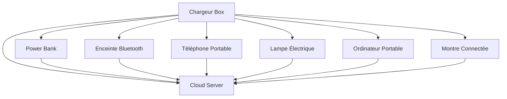

## Références

Référence [^1].

Dans les notes de bas de page, n'oubliez pas d'ajouter un `:` après le `[numéro]` pour un bon parsing.

---

## Classe d'Image

Vous pouvez appliquer des classes aux images en Markdown comme ceci :

```markdown
{: .centered }
{: .responsive }
*Source : Telegram*{: .caption }
```

Cela affichera l'image avec les classes spécifiées :

{: .centered }  
{: .responsive }  
*Source : Telegram*{: .caption }

## Table des matières

- [Introduction](#introduction)
- [Chapitre 1](#chapter-1)
- [Conclusion](#conclusion)

---

### Introduction

Voici l'introduction.

---

### Chapitre 1

Voici le Chapitre 1.

---

### Conclusion

Voici la conclusion.

## Mermaid



Ce n'est toujours pas rendu ici, mais cela fonctionne bien et peut être généré dans Mistral. Trouvons un moment pour en apprendre davantage.

---

[^1]: En voici un.
`