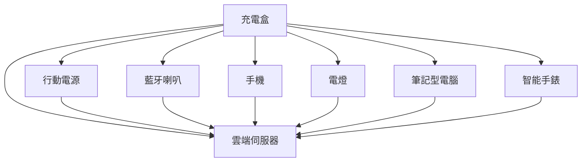

## 參考文獻

參考文獻 [^1]。

在腳註中，記得在 `[數字]` 後加上 `:` 以便正確解析。

---

## 圖片類別

你可以像這樣在 Markdown 中為圖片應用類別：

```markdown
{: .centered }
{: .responsive }
*來源：Telegram*{: .caption }
```

這將以指定的類別渲染圖片：

{: .centered }  
{: .responsive }  
*來源：Telegram*{: .caption }

## 目錄

- [介紹](#介紹)
- [第一章](#第一章)
- [結論](#結論)

---

### 介紹

這裡是介紹。

---

### 第一章

這裡是第一章。

---

### 結論

這裡是結論。

## Mermaid



這裡還沒有渲染出來，但在 Mistral 中運行良好。我們找時間多學習一下。

---

[^1]: 這裡是一個參考文獻。