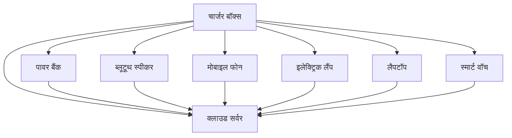

## संदर्भ

संदर्भ [^1]।

फुटनोट्स में, सही पार्सिंग के लिए `[संख्या]` के बाद एक `:` जोड़ना याद रखें।

---

## इमेज क्लास

आप Markdown में छवियों को इस तरह क्लासेस लागू कर सकते हैं:

```markdown
{: .centered }
{: .responsive }
*स्रोत: Telegram*{: .caption }
```

यह निर्दिष्ट कक्षाओं के साथ छवि को प्रस्तुत करेगा:

{: .centered }  
{: .responsive }  
*स्रोत: Telegram*{: .caption }

## विषय सूची

- [परिचय](#introduction)
- [अध्याय 1](#chapter-1)
- [निष्कर्ष](#conclusion)

---

### परिचय

यहाँ परिचय है।

---

### अध्याय 1

यहाँ पहला अध्याय है।

---

### निष्कर्ष

यहाँ निष्कर्ष है।

## मरमेड



यह अभी भी यहां प्रदर्शित नहीं हुआ है, लेकिन यह अच्छी तरह से काम करता है और Mistral में उत्पन्न किया जा सकता है। आइए कुछ समय निकालकर और अधिक सीखें।

---

[^1]: यहाँ एक है।
`