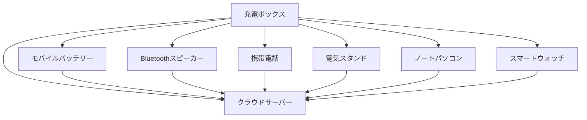

## 参考文献

参考文献 [^1]。

脚注では、正しい解析のために `[数字]` の後に `:` を追加することを忘れないでください。

---

## 画像クラス

Markdownで画像にクラスを適用するには、次のようにします：

```markdown
{: .centered }
{: .responsive }
*出典: Telegram*{: .caption }
```

これは指定されたクラスで画像をレンダリングします：

{: .centered }  
{: .responsive }  
*出典: Telegram*{: .caption }

## 目次

- [はじめに](#introduction)
- [第1章](#chapter-1)
- [結論](#conclusion)

---

### はじめに

以下が導入部です。

---

### 第1章

以下は第1章です。

---

### 結論

以下が結論です。

## Mermaid



ここではまだレンダリングされていませんが、うまく動作しており、Mistralで生成することができます。もっと学ぶ時間を見つけましょう。

---

[^1]: こちらがその一つです。
```