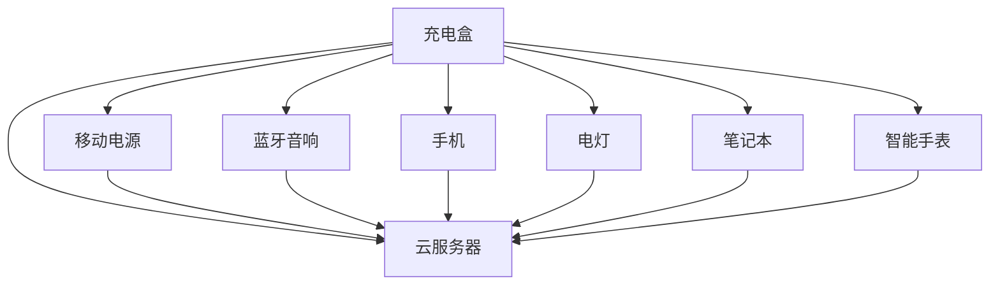

## 引用

参考 [^1]。

在脚注中，记得在 `[number]` 后面加上 `:` 以确保正确解析。

---

## 图片类

你可以像这样在Markdown中为图片应用类：

```markdown
{: .centered }
{: .responsive }
*来源: Telegram*{: .caption }
```

这将渲染带有指定类的图片：

{: .centered }  
{: .responsive }  
*来源: Telegram*{: .caption }

## 目录

- [简介](#introduction)
- [第一章](#chapter-1)
- [结论](#conclusion)

---

### 简介

这里是简介。

---

### 第一章

这里是第一章。

---

### 结论

这里是结论。

## Mermaid



这里仍然没有渲染出来，但它在Mistral中可以正常工作。我们可以找个时间进一步学习。

---

[^1]: 这是一个示例。
